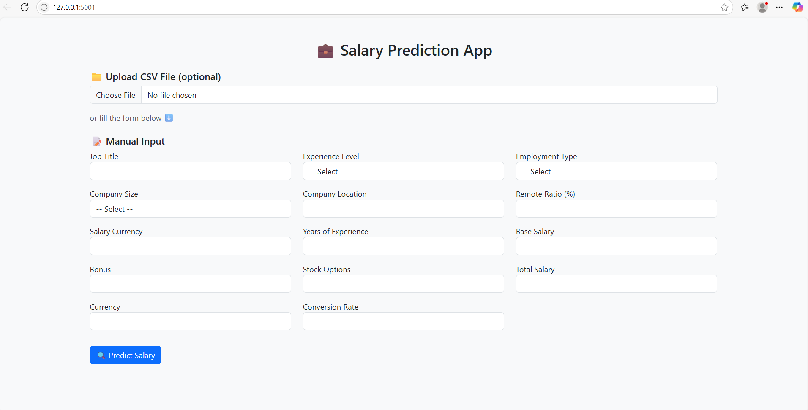
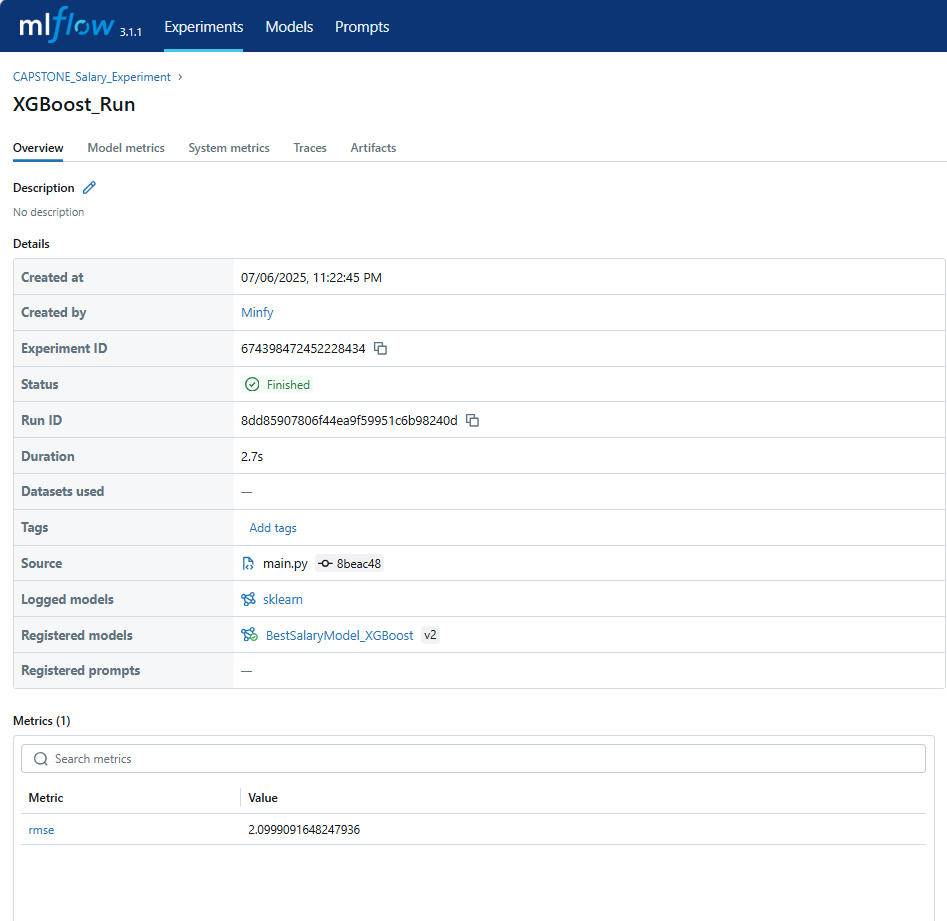
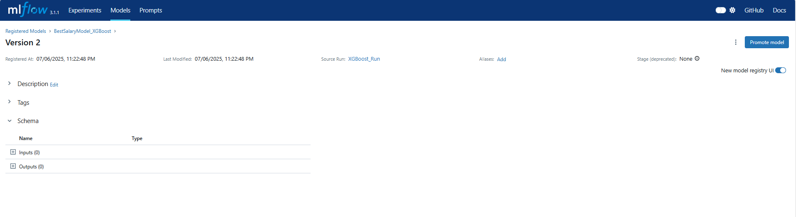

[](LICENSE)
# Capstone Salary Prediction – End-to-End ML Pipeline

This repository provides a complete machine learning pipeline to predict standardized employee salaries (in USD) across different job roles, countries, experience levels, and related attributes. The solution features robust data cleaning, exploratory data analysis (EDA), model building with MLflow experiment tracking, data drift monitoring using Evidently AI, and a production-ready Flask web API for real-time and batch salary predictions.

---

## 📑 Table of Contents

- [Screenshots](#screenshots)
- [Project Flow](#project-flow)
- [Features](#features)
- [Project Structure](#project-structure)
- [Installation](#installation)
- [Usage](#usage)
- [Model Deployment (Flask App)](#model-deployment-flask-app)
- [MLOps and Drift Monitoring](#mlops-and-drift-monitoring)
- [Contributing](#contributing)
- [License](#license)

---

## 🖼️ Screenshots

### 1. Flask Web App Interface
- Upload CSV files for batch salary predictions.
- Fill in job details manually for single prediction.
- Real-time standardized salary predictions in USD.
- Intuitive and interactive user interface.



### 2. MLflow Experiment Tracking
- Tracks all training experiments and versions.
- Visualizes metrics such as RMSE, MAE, and R².
- Stores hyperparameters, artifacts, and source code versions.



### 3. MLflow Model Registry
- Model promotion lifecycle: `None → Staging → Production`.
- Fully versioned with lineage from source runs.



### 4. EDA Report
- Automatically generated EDA report using `ydata-profiling`.
- Provides summary statistics, distributions, correlations, and missing value analysis.

[➡️ View EDA REPORT (PDF)](EDA%20INSIGHTS/EDA%20REPORT%201.pdf)

---

## 🔄 Project Flow

1. **Data Ingestion** – From CSV or PostgreSQL (configurable)
2. **Data Cleaning & Preprocessing** – Normalization, typo correction, winsorization
3. **EDA** – Automated profiling using `ydata-profiling`
4. **Feature Engineering** – Transformations for regression
5. **Model Training** – Decision Tree, Random Forest, XGBoost with GridSearchCV
6. **MLflow Tracking** – Metrics, artifacts, and model registry
7. **Evaluation** – RMSE, MAE, R², MAPE
8. **Drift Monitoring** – Evidently AI integration
9. **Deployment** – Flask web app for prediction (manual & batch)

---

## ✅ Features

- End-to-end ML pipeline with MLOps
- Currency standardization & typo correction
- Automated EDA profiling
- Grid search with modular pipelines
- MLflow for versioning and registry
- Evidently AI for drift detection
- Web UI for predictions (Flask)

---

## 🗂️ Project Structure

```
Capstone_instilit/
│
├── auto_eda_project/
│   ├── Data/
│   ├── Screenshots/
│   │   ├── Flask.png
│   │   ├── mlflow_exp.png
│   │   └── mlflow_model.png
│   ├── db/
│   ├── data_ingestion/
│   ├── preprocessing/
│   ├── model/
│   ├── mlflow/
│   ├── evidently_ai/
│   └── save_model/
│
├── EDA INSIGHTS/
│   └── EDA REPORT 1.pdf
│
├── main.py
├── requirements.txt
└── README.md
```


---

## ⚙️ Installation

### 1. Clone the Repository

git clone https://github.com/Lithin-7/Capstone_instilit.git
cd Capstone_instilit

### 2. Create & Activate Virtual Environment

python3 -m venv venv
source venv/bin/activate # On Windows: venv\Scripts\activate

### 3. Install Dependencies

pip install -r requirements.txt

## 🚀 Usage

### 🔧 Run the Full Pipeline

python main.py

- Edit `main.py` to toggle between PostgreSQL or CSV input, change file paths, or enable/disable pipeline stages.

### 📊 Generate EDA Report

from auto_eda_project.auto_eda_runner import run_autoeda
import pandas as pd

df = pd.read_csv('auto_eda_project/Data/Software_Salaries.csv')
run_autoeda(df, output_path='eda_output')

### 📉 Run Drift Monitoring

python auto_eda_project/evidently_ai/evidently_drift.py

### 📈 Launch MLflow UI

mlflow ui

Visit: http://localhost:5000 in your browser to track experiments and drift.

---

## 🌐 Model Deployment (Flask App)

### 🧪 Launch the Web Interface

python auto_eda_project/flask_app.py

- Open: http://localhost:5000
- Upload a CSV for bulk predictions
- Use the manual form for a single prediction
- Get instant USD salary estimates

---

## 🔁 MLOps and Drift Monitoring

### MLflow for:
- Experiment tracking
- Model registry
- Artifact versioning

### Evidently AI for:
- Input and target drift detection
- Drift reports logged to MLflow

---

## 🤝 Contributing

Feel free to fork this repo and open pull requests. All contributions are welcome.

---

## 📄 License

## 📄 License

This project is licensed under the [MIT License](LICENSE).
